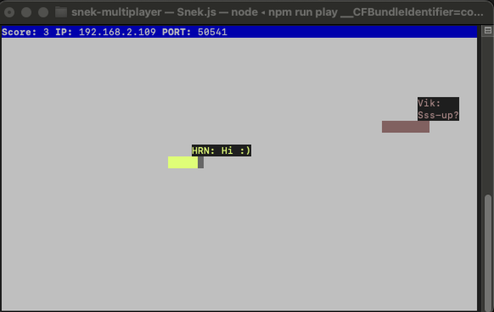

# Snake Client Project

Snake game is a very popular video game. It is a video game concept where the player maneuvers a dot and grows it by ‘eating’ pieces of food. 
As it moves and eats, it grows and the growing snake becomes an obstacle to smooth maneuvers. 
The goal is to grow it to become as big as possible without bumping into the side walls, or bumping into itself, upon which it dies.

This is simply a multiplayer take on the genre.

Before you can run this client, you will need to be running the server side first. 

## Final Product



## Features
- **Multiplayer Mode**: Join others on a server.
- **Movement**: Control your snake with `WASD`.
- **In-Game Chat**: Send messages like "Sss-up?", "Hi :)" or "XDD" using `q`, `e`, or `r`.
You can customise your messages.
- **Custom Name**: Connect with a personalized name sent to the server.

## Dependencies

- **Node.js**: Required to run the client. Install from [nodejs.org](https://nodejs.org/).

## Getting Started
- Follow steps inside the [snek server repo](https://github.com/lighthouse-labs/snek-multiplayer.git) to run the server side.
- Run the development snake client using the `node play.js` command to start the game:
```
git clone git@github.com:VktYe/snake-client.git
cd snake-client
node play.js
```
- To restart the game exit and then run node play.js again.

## Commands
Movement: W/w (up), A/a (left), S/s (down), D/d (right)
Chat: Q/q: "Sss-up?", E/e: "Hi :)", R/r: "XDD" 
Exit: Ctrl+C

## Customise Constants
- Edit constants.js in snake-client folder to change IP, PORT, name or any of the sayCommands.
```
const IP = 'localhost';
const PORT = '50541';
const name = "QWE";

const sayCommands = {
  'q': 'Sss-up?',
  'e': 'Hi :)',
  'r': 'XDD',
};
```
